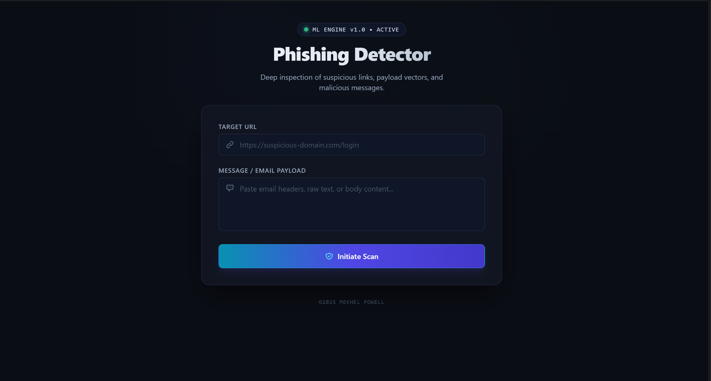
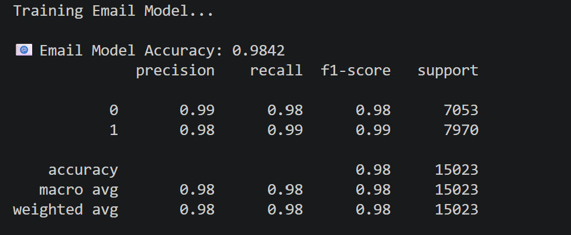
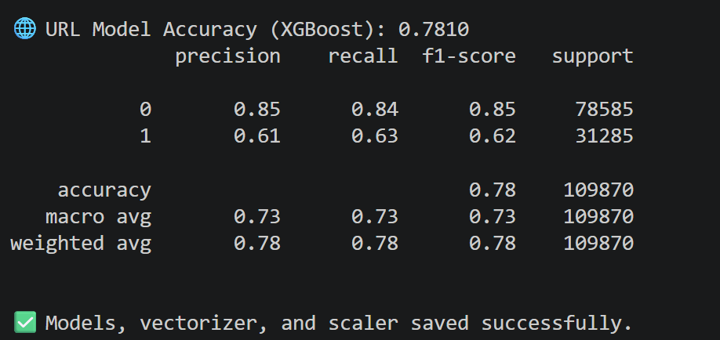

  <h1> Phishing Detector — ML Threat Detection Engine</h1>
  

    An end-to-end cybersecurity system engineered to classify malicious URLs and deceptive email/message payloads in real time. Powered by dual specialized machine learning models and wrapped in a high-contrast SOC dashboard interface.
  

  

    
  

  

    
    
    
    
    
    
  

<h2>📌 Introduction</h2>

  Phishing attacks remain the leading initial compromise vector across cyber operations, combining psychological manipulation with deceptive digital infrastructure. Traditional signature-based detection systems frequently fail against novel zero-day domains and targeted spear-phishing templates.

  <strong>Phishing Detector</strong> provides a dual-model defensive framework that simultaneously analyzes:

<ul>
  <li><strong>Payload Vector (Email/SMS):</strong> Evaluates lexical semantics, token frequency, and urgency signals via TF-IDF vectorization.</li>
  <li><strong>Destination Vector (URLs):</strong> Analyzes structural anomalies, character distributions, and suspicious address patterns using gradient boosting.</li>
</ul>

<h2>🛠️ Tech Stack & Architecture</h2>

<table width="100%">
  <thead>
    <tr>
      <th align="left">Domain</th>
      <th align="left">Technology</th>
      <th align="left">Purpose & Role</th>
    </tr>
  </thead>
  <tbody>
    <tr>
      <td><strong>Machine Learning</strong></td>
      <td><code>Scikit-Learn</code>, <code>XGBoost</code>, <code>Pandas</code>, <code>NumPy</code></td>
      <td>Dual-pipeline training: NLP vectorizer + Logistic Regression for text payloads; XGBoost gradient-boosted trees for URL features.</td>
    </tr>
    <tr>
      <td><strong>Backend Service</strong></td>
      <td><code>Python</code>, <code>Flask</code>, <code>Flask-CORS</code>, <code>Joblib</code></td>
      <td>RESTful API endpoints (<code>/predict</code>), input validation, and serialized model loading.</td>
    </tr>
    <tr>
      <td><strong>Frontend UI</strong></td>
      <td><code>React 18</code>, <code>Tailwind CSS</code>, <code>Axios</code></td>
      <td>Modern dark-mode dashboard (<code>#0a0d14</code>), async scan state handling, and real-time inference telemetry display.</td>
    </tr>
  </tbody>
</table>

<h2>⚡ Key Features</h2>
<ul>
  <li><strong>Concurrent Multi-Vector Analysis:</strong> Independent or combined assessment of suspected links and raw communication text.</li>
  <li><strong>Dynamic Confidence Scoring:</strong> Quantitative probability gauge indicating machine learning certainty per input.</li>
  <li><strong>Triage Severity Badging:</strong> Visual color-coded threat ratings (Safe, Medium, High).</li>
  <li><strong>SOC-Inspired Aesthetic:</strong> High-contrast, dark-mode design optimized for security operations and analyst workflows.</li>
</ul>

<h2>📊 Model Evaluation & Benchmarks</h2>

  The system uses separate, specialized classification pipelines designed around the distinct mathematical properties of natural language vs. URL network patterns.

<table width="100%">
  <thead>
    <tr>
      <th align="left">Task</th>
      <th align="left">Model Type</th>
      <th align="center">Validation Set Size</th>
      <th align="center">Accuracy</th>
      <th align="center">Malicious Precision</th>
      <th align="center">Malicious Recall</th>
      <th align="center">F1-Score</th>
    </tr>
  </thead>
  <tbody>
    <tr>
      <td><strong>Email Payload</strong></td>
      <td>Logistic Regression + TF-IDF</td>
      <td align="center">15,023</td>
      <td align="center"><strong>98.42%</strong></td>
      <td align="center">0.98</td>
      <td align="center">0.99</td>
      <td align="center"><strong>0.99</strong></td>
    </tr>
    <tr>
      <td><strong>Target URL</strong></td>
      <td>XGBoost (<code>XGBClassifier</code>)</td>
      <td align="center">109,870</td>
      <td align="center"><strong>78.10%</strong></td>
      <td align="center">0.61</td>
      <td align="center">0.63</td>
      <td align="center"><strong>0.62</strong></td>
    </tr>
  </tbody>
</table>

 

<table width="100%">
  <thead>
    <tr>
      <th width="50%" align="center">Email Model Output (98.42% Acc)</th>
      <th width="50%" align="center">URL Model Output (78.10% Acc)</th>
    </tr>
  </thead>
  <tbody>
    <tr>
      <td align="center">
        
      </td>
      <td align="center">
        
      </td>
    </tr>
  </tbody>
</table>

<blockquote>
  <strong>Performance Note:</strong> The Email model achieves exceptional precision (0.98) and recall (0.99) over 15,023 samples due to clear lexical signatures common to deceptive requests. The URL classifier is evaluated against a massive 109,870 validation instances, where high adversarial obfuscation presents a more challenging distribution.
</blockquote>

<h2>📁 Repository Structure</h2>

<pre>
├── backend/
│   ├── app.py                # Flask REST endpoints & inference pipeline
│   ├── model.py              # ML feature extraction, training, & saving
│   ├── models/               # Serialized .pkl / .joblib model artifacts
│   └── requirements.txt      # Python dependencies
├── frontend/
│   └── phishing-detector/
│       ├── src/
│       │   ├── App.jsx       # Threat detection dashboard component
│       │   └── main.jsx      # React entry point
│       └── package.json
└── screenshots/              # Readme evaluation & UI graphics
</pre>

<h2>🚀 Quickstart Guide</h2>

<h3>1. Backend Setup</h3>
<pre><code>cd backend
python -m venv .venv

# Windows
.venv\Scripts\activate
# macOS/Linux
source .venv/bin/activate

pip install -r requirements.txt
python app.py</code></pre>

<em>API server defaults to <code>http://localhost:5000</code>.</em>

<h3>2. Frontend Setup</h3>
<pre><code>cd frontend/phishing-detector
npm install
npm run dev</code></pre>

<em>Interface runs at <code>http://localhost:5173</code>.</em>

<h2>🎯 Conclusion & Roadmap</h2>

  <strong>Phishing Detector</strong> validates that lightweight vectorizers coupled with optimized gradient boosting deliver high-throughput, low-latency threat analysis suitable for integration into mail gateways, browser extensions, and SIEM/SOAR alert ingestion pipelines.

<h4>Future Improvements:</h4>
<ul>
  <li>Incorporate active WHOIS lookups (domain age, registrar entropy) into the feature set.</li>
  <li>Fine-tune a small transformer (such as DistilBERT) for comparison against TF-IDF on obfuscated emails.</li>
  <li>Package backend and frontend services into containerized Docker images.</li>
</ul>

<h2>📄 License</h2>

  This project is distributed under the <a href="LICENSE">MIT License</a>.

